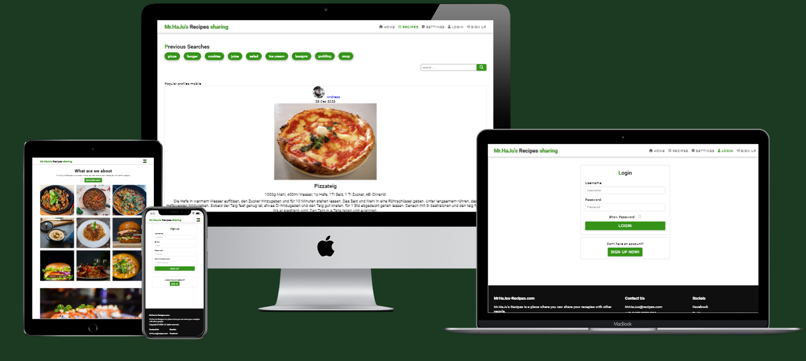

# MrHaJu's Recipes

MrHaJu's Recipes is a social media platform to share food recipes with other people. Users are able to share their recipes and try out recipes from other users. 
 
The live Page link can be found [here](https://recipe-share-pp5-ea6d44d9d1e0.herokuapp.com/)

## Strategy Plane

### Site Goals

MrHaJu's Recipes is aimed at all the home cooks out there. This site was built to share and try out recipes. Every registered user can post, like and bookmark recipes. Every visitor to the site can view and copy other users' recipes.

### Agile planning

I have developed this project by using agile methodologies by separating the small features in different epics. All user stories were assigned to different epics, subsequently divided between "Must have", "Should have" in order of priority and "saved for later" was added for those features planned at first but at the end discarted because of time constringements.
I created the Kanban board in GitHub projects and can be found [here](https://github.com/users/MrHaJu/projects/5/views/1).

## Epics

**Authentications**

This Epic covers the authentication features like sign up,  sign in and sign out.

**Navigation**

This epic covers the navigation and scrolling features of the application. This allows users to navigate around and access all features of the website.

**Recipes**

This epic covers the front end creation of "Recipes", the application's name for posts. This is to allow users to share their recipes with pictures, ingredients and an instruction aswell as likes and comments.

**Likes**

This epic covers the front end interaction to like a post. 

**Comments**

This epic covers the front end creation of comments underneath recipes. This is to allow users to create comments and interact with other users.

**Profile**

This epic covers the front end creation of the application with creating profiles. This is to allow users to interact with the backend API to create a profile, share Recipes, like  and comment to other users' recipes.

**Bookmark**

This epic covers the front end creation of the application with followers. This is to allow users to interact with the backend API via the user interface and allow users to bookmark each other's recipes so that their recipes can be visualized in the "feed"

By Epic:

**Authentication**

* As a User I can Sign Up so that I can interact with other users
* As a User I can Log In so that I can Post, Comment, Request and React
* As a User I can Log Out so that I can exit the website

**Navigation**

* As a User I can see the Navbar so I can reach all pages of the website
* As a User I can scroll down to see all the Posts

**Recipes**

* As a User I can post a Recipe so that I can share my recipes
* As a User I can edit a Recipe so that I can update the information
* As a User I can delete a Recipe so that it disappears from the feed
* As a User I can view all other Recipes
* As a User I can click on a Recipe so that I can see more details
* As a User I can React to a Recipe so that I can show what I think about it
* As a User I can see what Recipes I reacted to so I can see my feedback
* As a User I can search Recipes so that I can see the Recipes I am interested in
* As a User I can bookmark recipes so that I can find the recipes i want to cook

**Comment**

* As a User I can comment underneath a Recipe so that I can share my thoughts
* As a User I can edit a comment so that I can revise what I wrote
* As a User I can delete a comment so that it disappears from under the Recipe
* As a User I can read other comments so that I can see other user’s thoughts

**Profiles**

* As a User I can create a profile so that I can interact with other users
* As a User I can see other people’s user so that I can see what they posted
* As a User I can see how many Recipe, Comments, bookmarks and likes that profile has so that I can see the profiles with most interaction

**bookmarks**

* As a User I can bookmark posts so that I can stay up to date with them
* As a User I can unbookmark a post so that I can stop staying up to date.

**Authentications**

User Story:

`As a User I can Sign Up so that I can interact with other users`

Implementation:

A signup page was implemented with Django Rest Framework (DRF) authentication. Also there is a signin form in case the user already has an account.

User Story:

`As a User I can Log In so that I can Post, Comment, Bookmark and Like`

Implementation:

Only logged in users can add a recipe, comment, bookmark and like to other recipes. It was made sure that navbar shows different options accordingly to logged in or logged out users.

User Story:

`As a User I can Log Out so that I can exit the website`

Implementation:

A "sign out" button is visible on the navbar only to logged in users. 
User Story:

`As a User I can navigate the website on mobile devices`

Implementation:

A navigation menu was implemented than collapses into a hamburger menu on smaller devices.
This will ensure that no navigation items overlap and users can access and navigate the site from any size device.

**Navigation**

User Stories:

`As a User I can see the Navbar so I can reach all pages of the website`

Implementation:

Navigation menu is implemented on top of the page, it collapses into a hamburger menu on small screens. It ensures navigation on each type of screen.

Logged in users can see different features on the navbar than the logged out users.

Logged in users:

When a user is logged in the following navigation items are shown:

* Add recipe
* Home
* Settings
* recipes 
* Liked
* bookmarked
* Log Out
* Profile

Logged out users:

* Home
* Settings
* Recipes
* Log In
* Sign Up

The site's Name is displayed on the left side of the navigation at all times.

The navigation icons highlight in the primary colour when the page is active in order to indicate which page the user is currently on.

The navigation icons are highlighted on mouse hover with a line underneath in the primary color to indicate which page the user is currenly choosing.

User Story:

`As a User I can scroll down to see all the Recipes`

Implementation:

An infinite scroll has been implemented on the recipes page to display all recipes starting with the most recent. Both logged in and logged out users can display the recipes on the recipes Page.

By making the contect accessable also to non registered users gives them the possibility to see the content of the web application and make them interested in signing up.

**Recipes**

User Story:

`As a User I can post a Recipe so that I can share my recipes`

Implementation:

An "Add recipe" button is implemented in the navbar and is visible to signed in users. 

User Story:

`As a User I can edit a Recipe so that I can update the information`

Implementaton:

Users who are owner of a recipe have the possibility to edit their recipe by clicking on the three dots on the top right corner of their recipe. This way they can update recipe information.

User Story:

`As a User I can delete a Recipe so that it disappears from the feed`

Implementation:

Similaryl to the edit function, the recipe owner can click on the three dots on the top right corner of their recipe and delete it from the web application. 

User Stories:

`As a User I can view all other Recipes`

Implementation:

Both logged in and logged out users have access to recipes and their details. They can read comments ans see how many times recipes have been liked or bookmarked. This is in order to engage new users and make them want to sign up.

User Story:

`As a User I can click on a Recipe so that I can see more details`

Implementation:

All users can click on the image of a Recipe and see its details, like the instruction text. They can see what the recipe owner has written.

User Story:

`As a User I can React to a Recipe so that I can show what I think about it`

Implementation:

Logged in users have the possibility to react in three different ways to other people's recipes. Like, for positive feedback, comment, for suggestions or reviews, and bookmark to save the recipes they like the most. Logged out users cannot react and are shown a message when hovering over the icons. A user cannot react to their own recipes and they are also informed about this while hovering. The number of each reaction is display underneath each recipe

User Story:

`As a User I can see what Recipes I reacted to so I can see my feedback`

Implementation:

Logged in users can click on "Liked" or "Bookmarked" so they can access all recipes they have ever reacted to.

User Story:

`As a User I can search Recipes so that I can see the recipes I am interested in`

Implementation:

All users can search for any term within recipes in the search bar at the top of the recipes page. This way they can look for specific recipes.
