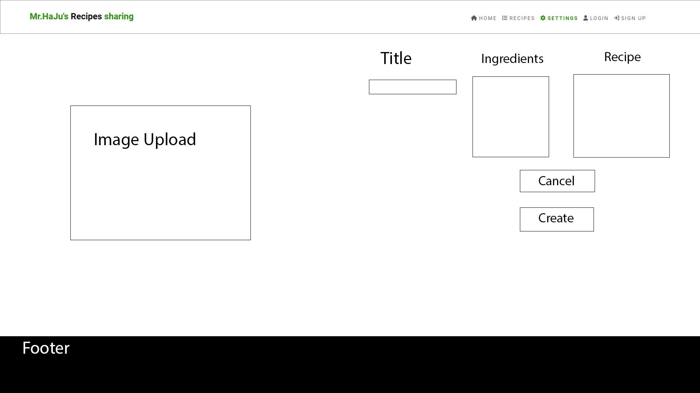

# MrHaJu's Recipes

MrHaJu's Recipes is a social media platform to share food recipes with other people. Users are able to share their recipes and try out recipes from other users. 
<br>
The live Page link can be found [here](https://recipe-share-pp5-ea6d44d9d1e0.herokuapp.com/)


## Strategy Plane

### Site Goals

MrHaJu's Recipes is aimed at all the home cooks out there. This site was built to share and try out recipes. Every registered user can post, like and bookmark recipes. Every visitor to the site can view and copy other users' recipes.


### Agile planning

I have developed this project by using agile methodologies by separating the small features in different epics. All user stories were assigned to different epics, subsequently divided between "Must have", "Should have" in order of priority and "saved for later" was added for those features planned at first but at the end discarted because of time constringements.
I created the Kanban board in GitHub projects and can be found [here](https://github.com/users/MrHaJu/projects/5/views/1).

## Epics

**Authentications**

This Epic covers the authentication features like sign up,  sign in and sign out.

**Navigation**

This epic covers the navigation and scrolling features of the application. This allows users to navigate around and access all features of the website.

**Recipes**

This epic covers the front end creation of "Recipes", the application's name for posts. This is to allow users to share their recipes with pictures, ingredients and an instruction aswell as likes and comments.

**Likes**

This epic covers the front end interaction to like a post. 

**Comments**

This epic covers the front end creation of comments underneath recipes. This is to allow users to create comments and interact with other users.

**Profile**

This epic covers the front end creation of the application with creating profiles. This is to allow users to interact with the backend API to create a profile, share Recipes, like  and comment to other users' recipes.

**Bookmark**

This epic covers the front end creation of the application with followers. This is to allow users to interact with the backend API via the user interface and allow users to bookmark each other's recipes so that their recipes can be visualized in the "feed"


<hr>

By Epic:

**Authentication**

* As a User I can Sign Up so that I can interact with other users
* As a User I can Log In so that I can Post, Comment, Request and React
* As a User I can Log Out so that I can exit the website

**Navigation**

* As a User I can see the Navbar so I can reach all pages of the website
* As a User I can scroll down to see all the Posts

**Recipes**

* As a User I can post a Recipe so that I can share my recipes
* As a User I can edit a Recipe so that I can update the information
* As a User I can delete a Recipe so that it disappears from the feed
* As a User I can view all other Recipes
* As a User I can click on a Recipe so that I can see more details
* As a User I can React to a Recipe so that I can show what I think about it
* As a User I can see what Recipes I reacted to so I can see my feedback
* As a User I can search Recipes so that I can see the Recipes I am interested in
* As a User I can bookmark recipes so that I can find the recipes i want to cook


**Comment**

* As a User I can comment underneath a Recipe so that I can share my thoughts
* As a User I can edit a comment so that I can revise what I wrote
* As a User I can delete a comment so that it disappears from under the Recipe
* As a User I can read other comments so that I can see other user’s thoughts


**Profiles**

* As a User I can create a profile so that I can interact with other users
* As a User I can see other people’s user so that I can see what they posted
* As a User I can see how many Recipe, Comments, bookmarks and likes that profile has so that I can see the profiles with most interaction


**bookmarks**

* As a User I can bookmark posts so that I can stay up to date with them
* As a User I can unbookmark a post so that I can stop staying up to date.

**Authentications**

User Story:

`As a User I can Sign Up so that I can interact with other users`

Implementation:

A signup page was implemented with Django Rest Framework (DRF) authentication. Also there is a signin form in case the user already has an account.

User Story:

`As a User I can Log In so that I can Post, Comment, Bookmark and Like`

Implementation:

Only logged in users can add a recipe, comment, bookmark and like to other recipes. It was made sure that navbar shows different options accordingly to logged in or logged out users.

User Story:

`As a User I can Log Out so that I can exit the website`

Implementation:

A "sign out" button is visible on the navbar only to logged in users. 
User Story:

`As a User I can navigate the website on mobile devices`

Implementation:

A navigation menu was implemented than collapses into a hamburger menu on smaller devices.
This will ensure that no navigation items overlap and users can access and navigate the site from any size device.

**Navigation**

User Stories:

`As a User I can see the Navbar so I can reach all pages of the website`

Implementation:

Navigation menu is implemented on top of the page, it collapses into a hamburger menu on small screens. It ensures navigation on each type of screen.

Logged in users can see different features on the navbar than the logged out users.

Logged in users:

When a user is logged in the following navigation items are shown:

* Add recipe
* Home
* Settings
* recipes 
* Liked
* bookmarked
* Log Out
* Profile

Logged out users:

* Home
* Settings
* Recipes
* Log In
* Sign Up

The site's Name is displayed on the left side of the navigation at all times.

The navigation icons highlight in the primary colour when the page is active in order to indicate which page the user is currently on.

The navigation icons are highlighted on mouse hover with a line underneath in the primary color to indicate which page the user is currenly choosing.

User Story:

`As a User I can scroll down to see all the Recipes`

Implementation:

An infinite scroll has been implemented on the recipes page to display all recipes starting with the most recent. Both logged in and logged out users can display the recipes on the recipes Page.

By making the contect accessable also to non registered users gives them the possibility to see the content of the web application and make them interested in signing up.

**Recipes**

User Story:

`As a User I can post a Recipe so that I can share my recipes`

Implementation:

An "Add recipe" button is implemented in the navbar and is visible to signed in users. 

User Story:

`As a User I can edit a Recipe so that I can update the information`

Implementaton:

Users who are owner of a recipe have the possibility to edit their recipe by clicking on the three dots on the top right corner of their recipe. This way they can update recipe information.

User Story:

`As a User I can delete a Recipe so that it disappears from the feed`

Implementation:

Similaryl to the edit function, the recipe owner can click on the three dots on the top right corner of their recipe and delete it from the web application. 

User Stories:

`As a User I can view all other Recipes`

Implementation:

Both logged in and logged out users have access to recipes and their details. They can read comments ans see how many times recipes have been liked or bookmarked. This is in order to engage new users and make them want to sign up.

User Story:

`As a User I can click on a Recipe so that I can see more details`

Implementation:

All users can click on the image of a Recipe and see its details, like the instruction text. They can see what the recipe owner has written.

User Story:

`As a User I can React to a Recipe so that I can show what I think about it`

Implementation:

Logged in users have the possibility to react in three different ways to other people's recipes. Like, for positive feedback, comment, for suggestions or reviews, and bookmark to save the recipes they like the most. Logged out users cannot react and are shown a message when hovering over the icons. A user cannot react to their own recipes and they are also informed about this while hovering. The number of each reaction is display underneath each recipe


User Story:

`As a User I can see what Recipes I reacted to so I can see my feedback`

Implementation:

Logged in users can click on "Liked" or "Bookmarked" so they can access all recipes they have ever reacted to.

User Story:

`As a User I can search Recipes so that I can see the recipes I am interested in`

Implementation:

All users can search for any term within recipes in the search bar at the top of the recipes page. This way they can look for specific recipes.

User Story:

`As a User I can follow another User so that I can stay updated on what they post`

Implementation:

Logged in users can follow other users so that their recipes appear under "recipes" and they can stay up to date with all recipes from their favorite users.

**Comments**

Comments are visible under each recipe for both logged out and logged in users. Logged in users have the possibility to add comments under each recipe.

An icon display the number of comments under each recipe, to allow users to see which recipes have most comments. Each comment will show the clickable username of its author and their Avatar.

**Profiles**

User Story:

`As a User I can create a profile so that I can interact with other users`

Implementation:

The user can create a profile and upload a picture shown as their Avatar. They can also write a text in their profile to tell more about themselves.

User Story:

`As a User I can see other people’s user so that I can see what they posted`

Implementation:

Profile Page has been implemented where a user can click on an Avatar and visit their profile. To view a their own profile, they click on their on Avatar from the navigation menu.

User Story:

`As a User I can see how many Recipes, Comments, Followers and Reacts that profile has so that I can see the profiles with most interaction`

Implemenation:

On the Profile page it is displayed the number of how many Recipes, Followers the user has and the number of users they follow.

**Epic Followers**

User Story:

`As a User I can follow another user so that I can stay up to date with them`

Implementation:

A user can visit a user's profile and click on the "Follow" button at the top right corner of the profile.

User Story:

`As a User I can unfollow a user so that I can stop staying up to date.`

Implementation: 

Once a user has followed another user, they can unfollow them by clicking on the button with the same name on the top left corner of the profile.

User Story:

`As a User I can see which profiles have the most follower so that I can see which are the most interesting`

Implementation:

On the right hand side of the homepage a user can see a list of most followed profiles. Next to the name of each user a button "Follow" appears if the user don't follow them already, or "Unfollow.

### Future Features

<hr>
<br>

## The Skeleton Plane

### Wireframes

<details>

<summary>All Wireframe Images</summary>
Homepage


Plant Component


Profile Component


Recipe Create / Edit Component



Settings


</details>

## The Surface Plane

### Design

#### Logo

The logo is used as a Favicon. created in Photoshop


#### Color-Scheme

The colors chosen for this project are white and dark grey for the Background. As primary colors to choose in the settings tab, i used a couple highlite colors like green, blue, yellow and purple. For text depending on the background it's black or white


<hr>
<br>

#### Typography

The font used for the website is "Roboto Sans", in case that is not available the system will render a generic sans serif.
<hr>
<br>


## Database Design

The database design includes the models from the django rest walkthrough and also a model for Ingredients and bookmark

.png)

## Security

A permissions class named IsOwnerOrReadOnly has been introduced to ensure that only users who have created the content are granted the ability to edit or delete it.

## Technologies

* React
    * The main framework used for building the user interface. 
* Node
    * A tool for managing package installations and dependencies. Used in the Node.js ecosystem.
* Bootstrap
    * Front-end framework used for styling and UI components. 
    * A React-specific implementation of Bootstrap components. 
* React Router DOM
    * A library for handling routing in React applications. Version 6.2.0.
* Axios
    * A library for making HTTP requests. 
* JWT Decode
    * A library for decoding JWT (JSON Web Tokens). Version 
* React Infinite Scroll Component
    * A component for implementing infinite scrolling in React applications. 
* React Scripts
    * Scripts and configurations used for building and running React applications. 
* Django
    * Main framework used for application creation
* Django REST Framework
    * Framework used for creating API
* Cloudinary
    * Used for static image hosting
* Heroku
    * Used for hosting the application
* Git
    * Used for version control
* Github
    * Repository for storing code base and docs


<hr>
<br>

## Python Packages
<details open>
<summary> Details of packages </summary>

* asgiref==3.7.2
    * ASGI specification (Asynchronous Server Gateway Interface)
* certifi==2023.11.17
    * Used to verify SSL certificates
* cffi==1.16.0
    * Python library that provides a foreign function interface (FFI) for calling functions and using data defined in other languages
* charset-normalizer==3.3.2
    * Python library that provides functions for normalizing and working with character encodings. 
* cloudinary==1.36.0
    * Cloudinary integration for image and video storage
* dj-database-url==0.5.0
    * Used to parse the DATABASE_URL connection settings
* dj-rest-auth==2.1.9
    * Used with the authentication system
* Django==3.2.23
    * Main framework used to start the project
* django-allauth==0.44.0
    * Used for authentication
* django-cloudinary-storage==0.3.0
    * Cloudinary storage backend for Django
* django-cors-headers==4.3.1
    * Used for Cross-Origin Resource Sharing (CORS) headers in responses
* django-filter==23.4
    * Used to filter API results in serializers
* djangorestframework==3.14.0
    * Framework used to build API endpoints
* djangorestframework-simplejwt==5.3.1
    * Used with Django Rest Framework to create access tokens for authentication
* gunicorn==21.2.0
    * Used for deployment of WSGI applications
* oauthlib==3.2.2
    * Library for implementing OAuth 1.0 and OAuth 2.0 providers
* packaging==23.2
    * vor version parsing
* Pillow==10.1.0
    * Imaging Library - used for image uploading
* psycopg2==2.9.9
    * PostgreSQL database adapter to allow deployed application to perform CRUD on the PostgreSQL DB
* pycparser==2.21
    * is a Python library for parsing C code. 
* PyJWT==2.8.0
    * For creating Python JSON Web Tokens for authentication
* python3-openid==3.2.0
    * Python OpenID library
* pytz==2023.3.post1
    * World timezone definitions, modern and historical
* requests==2.31.0
    * Python library, often used for making HTTP requests. 
* requests-oauthlib==1.3.1
    * OAuthlib integration with Requests
* sqlparse==0.4.4
    * SQL parser for Python
* urllib3==1.26.15
    * a Python library for making HTTP requests. 
* whitenoise==6.6.0
    * Simplifies serving of static files

</details>
<hr>
<br>

## Testing

Testing can be found in the [TESTING.md file](/Testing.md)
<hr>
<br>

**Bugs and their fixes**

There was an error with Following. New created users could not follow each other because of the user pk ant the profile id where different reulting from deleting and creating users.


I solved it by resetting the database.

<hr>
<br>

## Deployment

### Workspaces Unification

Originally, the Front End and the API were developed on two separate workspaces. The React workspace can be found [here](https://github.com/MrHaJu/Code-Institute-Projekt-5-React-recipe-share). I then proceeded by copying the Front End into the API workspace doing as follows:

* I went to the GitHub repository for the React project
* I clicked the "Code" button, select the HTTPS tab, and copied the URL provided
* I opened the workspace for my API project
* I opened the terminal window and typed the command `git clone react_repo_url frontend` by adding the URL of the workspace
* I removed unnecessary files from the frontend folder
* I installed npm packages 
* I added a new key to the JSON object inside package.json file
* I modified the env.py file and removed CLIENT_ORIGIN_DEV, added new kews ALLOWED_HOST and CLIENT_ORIGIN
* I removed CORS code


### Deployment of both applications

* I created a new empty folder called staticfiles in the root directly
* In the TEMPLATES list at the DIRS key, I added code to tell Django and WhiteNOise where to look for Reacts index.html in deployment
* I added the STATIC_ROOT and WHITENOISE_ROOT variables and values to tell Django and WHiteNoise where to look for the admin static files and React static files
* I removed root_route view from the .views imports and imported the TemplateView from generic Django views
* I removed the root_route code in the url_patterns list
* I added `api/` at the beginning of all API URLs.
* I set the axios.default.baseURL to `api/` in the axiosDefaults.js file
* I collected the admin and API staticfiles to the empty staticfiles directory
* I compiled and moved the React files into the frontend directory
* I added a runtime.txt file to ensure Heroku uses the correct version of Python
* I logged into my Heroku acount
* I went to Settings and opened the Config vars
* As ALLOWED_HOST key, I set the URL of the combined project without the `https://`
* As CLIEN_ORIGIN key, I set the URL of the combined project
* I clicked on the "Deploy" tab on Heroku and deployed by clicking on "Deploy Branch"

<hr>
<br>
The live link can be found here: [Live Site - Plant Parenthood](https://recipe-share-pp5-ea6d44d9d1e0.herokuapp.com/)
<br>

## Version Control

The site was created using the GitPod online editor and pushed to github to the remote repository ‘plant-parenthood’ on GitHub.

In order to push the changes to the repository I used the following commands:

```git add <file>``` - This command adds the file to be saved.

```git commit -m “commit message”``` - This command enters a commit message.

```git push``` - This command pushes all the changes to GitHub.

<hr>
<br>

### Run Locally


To clone the GitHub repository you want to use locally, follow these steps:

- Go to the repository on GitHub.
- Find the dropdown button named "Code."
- Choose "HTTPS" from the options.
- Copy the repository link.
- Launch your favorite integrated development environment (IDE) and make sure Git is installed.
- Open the terminal in your IDE.
- Type git clone followed by the copied repository URL.
- Press Enter to clone the project to your local machine.
- Your local copy of the project is now set up and ready for use.

Install Dependencies:

`npm install`

Launch the Application:

`npm start`

<hr>
<br>

### Forking


Forks are typically employed either to suggest modifications to another person's project or as a foundation for your own concept.

- Visit the GitHub Repository you wish to fork.

- Click the fork button situated in the top right corner under the header.

- This action will generate a duplicate of the entire project within your GitHub Repository.
<hr>
<br>


**Virtual Environment setup** 

Windows:

```
python -m venv venv \
venv/Scripts/activate \
pip install -r requirements.txt
```

Mac:

```
python -m venv venv \
source venv/bin/activate \
pip install -r requirements.txt
```


## Cloudinary Storage

This project uses Cloudinary to storage the user's images. Please see this guide for setting up your own storage [Cloudinary Onboarding Guide](https://cloudinary.com/documentation/how_to_integrate_cloudinary#:~:text=You%20can%20sign%20up%20for%20Cloudinary%20using%20an%20email%20address,set%20your%20account%20as%20active.). The service account credentials will be needed for deployment.

**Heroku**

1. Log in to heroku and open the pp-api app
2. Click settings
3. Click Config vars
4. Add the following variables:

    * Key: CLOUDINARY_URL -  Value: URL to Cloudinary Assets folder.


## Credits

### Content

- The project is based mainly on the "Moments" walkthrough by Code Institute.
- The Design is taken from the youtube tutorial [Angle Brace](https://www.youtube.com/watch?v=iY0AY5IckGg)
- All pictures uploaded are private property. 

### Acknowledgements

I would like to thank my mentor, Jubril Acolade, for his support during this project.