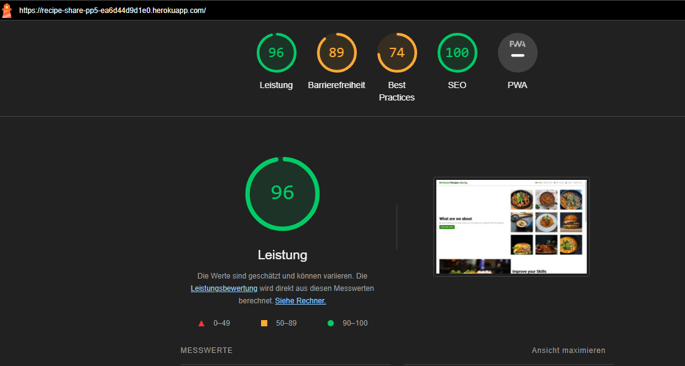
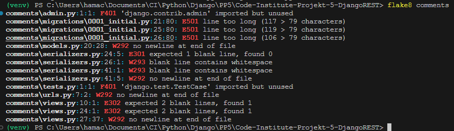
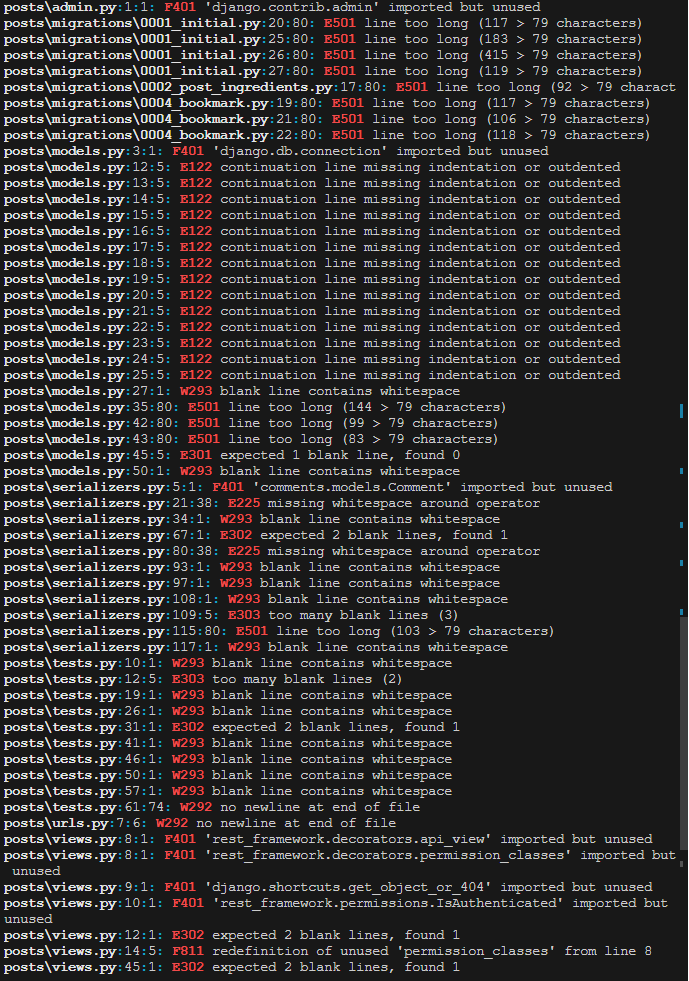
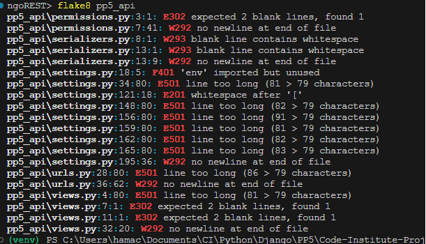
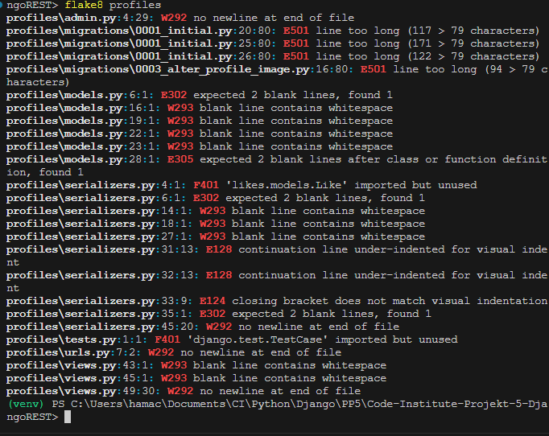

# Testing

The API testing was initially conducted locally in the development phase. However, the primary testing took place within the frontend repositories. To assess the real APIs, manual testing was performed by interacting with form inputs and navigating through page loads.

# Lighthouse Testing

Lighthouse testing revealed poor performance. While this was expected with a large number of images, it could be improved in the future by compressing images before uploading them. Unfortunately, I did not have time to implement this functionality in this iteration.

# Validator Testing

## Python Validation

All directories underwent flake8 analysis, revealing several issues related to different factors such as excessive line lengths, white spaces, indentation, and docstring concerns.

All identified issues were addressed, except for those associated with line lengths in migration files (auto-generated and left untouched).

A warning was flagged for env.py being imported but unused; however, it was disregarded since it is actively utilized in the development version.

## CSS Validation

All CSS files were validated and no errors were found.

